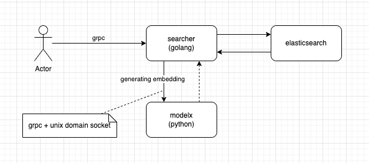
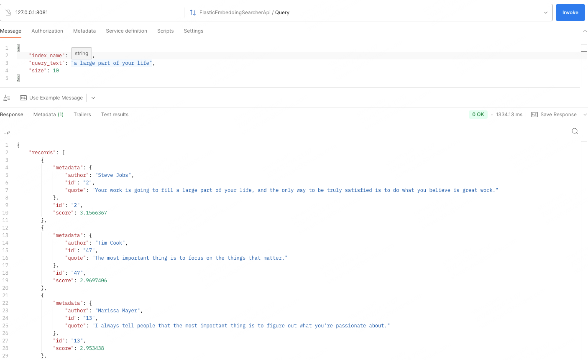
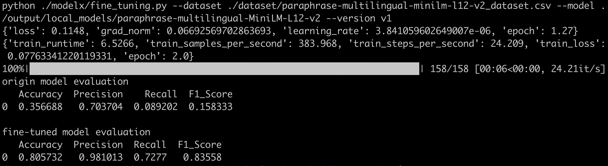
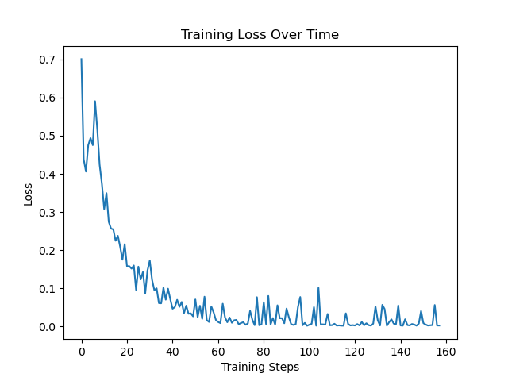
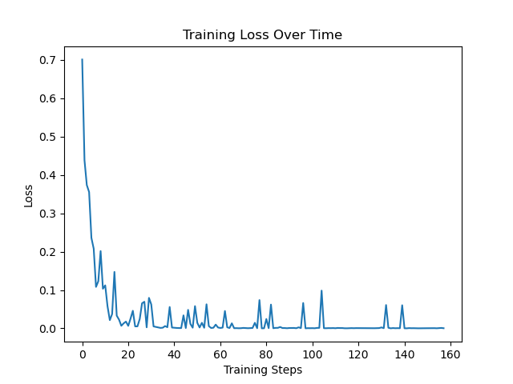

English | [中文](README_ZH.md)

# Semantic Search with Elasticsearch and HuggingFace Model Embeddings  

This project enables efficient semantic search by combining Elasticsearch with embeddings generated using HuggingFace models.  

## Key Features  
- **Embedding Generation:** Easily integrate HuggingFace's open-source models to generate high-quality embeddings for textual data.  
- **Elasticsearch Support:** Leverage Elasticsearch's powerful indexing and querying capabilities for scalable semantic search.  
- **Customizable Models:** Choose and configure embedding models to match your application's specific needs.  
- **Fast Semantic Retrieval:** Perform similarity-based searches to enhance user experiences with relevant and meaningful results.  

This repository is ideal for building applications such as document search engines, recommendation systems, and knowledge management tools.  

Get started quickly to implement cutting-edge semantic search tailored to your use case.  

## Architecture


## Dependencies
- go ~> 1.22
- python ~> 3.12
- protoc ~> 25.3
- transformers==4.43.3
- sentence-transformers==3.0.1

## Usage
- Install Dependencies
   Ensure all required tools and libraries are installed:
```bash
make deps
```

- Start the Semantic Search Application
```bash
# ./bin/searcher -e http://127.0.0.1:9200 -m ./local_models/paraphrase-multilingual-MiniLM-L12-v2
# -e to specific elasticsearch address.
# -m to specific model. no relative path means that loading from hugging-face.
make run
```

- Upload the CSV file, generate embeddings, and then sync to Elasticsearch.


- Query by semantic.


- Fine-tuning model
```bash
# python ./modelx/fine_tuning.py --dataset ./dataset/paraphrase-multilingual-minilm-l12-v2_dataset.csv --model ./output/local_models/paraphrase-multilingual-MiniLM-L12-v2 --version v1
# --dataset specific the fine-tuning dataset.
# --model specific model you want to fine-tuning.
make ft
```
**console output**


**learning_rate = 0.00001**


**learning_rate = 0.0001, look better**


```text
I am a happy programming monkey.

                          ___
                      .-'`     `'.
               __    /  .-. .-.   \
            .'`__`'.| /  ()|  ()\  \
           / /`   `\\ |_ .-.-. _|  ;  __
           ||     .-'`  (/`|`\) `-./'`__`'.
           \ \. .'                 `.`  `\ \
            `-./  _______            \    ||
               | |\      ''''---.__   |_./ /
               ' \ `'---..________/|  /.-'`
                `.`._            _/  /
                  `-._'-._____.-' _.`
                   _,-''.__...--'`
               _.-'_.    ,-. _ `'-._
            .-' ,-' /   /   \\`'-._ `'.
          <`  ,'   /   /     \\    / /
           `.  \  ;   ;       ;'  / /_
     __   (`\`. \ |   |       ||.' // )
  .'`_ `\(`'.`.\_\|   |    o  |/_,'/.' )
 / .' `; |`-._ ` /;    \     / \   _.-'
 | |  (_/  (_..-' _\    `'--' | `-.._)
 ; \        _.'_.' / /'.___.; \
  \ '-.__.-'_.'   ; '        \ \
   `-.,__.-'      | ;         ; '
                  | |         | |
                  | |         / /
                .-' '.      ,' `-._
              /`    _ `.   /  _    `.
             '-/ / / `\_) (_/` \  .`,)
              | || |            | | |
              `-'\_'            (_/-'
```                                 
