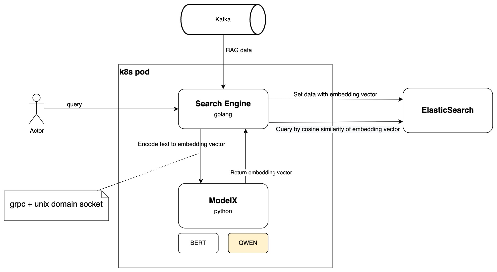
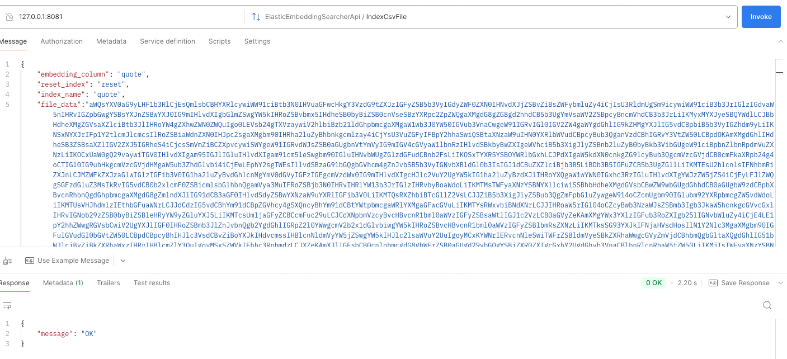

English | [中文](README_ZH.md)

# Semantic Search with Elasticsearch and HuggingFace Model Embeddings  

This project enables efficient semantic search by combining Elasticsearch with embeddings generated using HuggingFace models.  

## Key Features  
- **Embedding Generation:** Easily integrate HuggingFace's open-source models to generate high-quality embeddings for textual data.  
- **Elasticsearch Support:** Leverage Elasticsearch's powerful indexing and querying capabilities for scalable semantic search.  
- **Customizable Models:** Choose and configure embedding models to match your application's specific needs.  
- **Fast Semantic Retrieval:** Perform similarity-based searches to enhance user experiences with relevant and meaningful results.  

This repository is ideal for building applications such as document search engines, recommendation systems, and knowledge management tools.  

Get started quickly to implement cutting-edge semantic search tailored to your use case.  

## Architecture


## Dependencies
- go ~> 1.22
- python ~> 3.12
- protoc ~> 25.3
- transformers==4.43.3
- sentence-transformers==3.0.1

## Usage
- Install Dependencies
   Ensure all required tools and libraries are installed:
```bash
make deps
```

- Start the Semantic Search Application
```bash
# ./bin/searcher -e http://127.0.0.1:9200 -m ./local_models/paraphrase-multilingual-MiniLM-L12-v2
# -e to specific elasticsearch address.
# -m to specific model. no relative path means that loading from hugging-face.
make run
```

- Upload the CSV file, generate embeddings, and then sync to Elasticsearch.


- Query by semantic.


- Kafka Consumer Example  
Below is an example implementation for consuming messages from Kafka, processing them, and indexing them in Elasticsearch with semantic embeddings.
```go
package main

import (
   "context"
   "fmt"
   "log"
   "strings"
   "time"

   "github.com/segmentio/kafka-go"
)

// Constants
const (
   kafkaBroker    = "localhost:9092"
   kafkaTopic     = "quotes-test"
   testIndex      = "test_index"
   embeddingDim   = 384
   embeddingPart  = embeddingDim / 2 // Split embedding dimensions into two parts
)

// Sample messages
var MessageSet = []messages.IMessage{
   messages.NewMessage(`{"id":"1", "quote":"The only limit to our realization of tomorrow is our doubts of today.", "author":"Franklin D. Roosevelt"}`),
   messages.NewMessage(`{"id":"2", "quote":"In the middle of difficulty lies opportunity.", "author":"Albert Einstein"}`),
   messages.NewMessage(`{"id":"3", "quote":"Success is not final, failure is not fatal: It is the courage to continue that counts.", "author":"Winston Churchill"}`),
   messages.NewMessage(`{"id":"4", "quote":"Be yourself; everyone else is already taken.", "author":"Oscar Wilde"}`),
   messages.NewMessage(`{"id":"5", "quote":"Do what you can, with what you have, where you are.", "author":"Theodore Roosevelt"}`),
   messages.NewMessage(`{"id":"6", "quote":"Not everything that is faced can be changed, but nothing can be changed until it is faced.", "author":"James Baldwin"}`),
   messages.NewMessage(`{"id":"7", "quote":"The best way to predict the future is to create it.", "author":"Peter Drucker"}`),
   messages.NewMessage(`{"id":"8", "quote":"Happiness is not something ready made. It comes from your own actions.", "author":"Dalai Lama"}`),
   messages.NewMessage(`{"id":"9", "quote":"It always seems impossible until it’s done.", "author":"Nelson Mandela"}`),
   messages.NewMessage(`{"id":"10", "quote":"You miss 100% of the shots you don’t take.", "author":"Wayne Gretzky"}`),
}

func main() {
    ctx := context.Background()
	
	// Step 1: Create Elasticsearch index 
	indexMapping := fmt.Sprintf(elastic.IndexEmbeddingMapping, embeddingPart, embeddingPart)
    err := elastic.CreateIndex(context.Background(), testIndex, indexMapping)
    if err != nil {
		clog.Error(ctx, "failed to create Elasticsearch index: %v", err)
    }

    // Step 2: Set up Kafka consumer and listener
    consumer := messages.NewKafkaConsumer([]string{kafkaBroker}, kafkaTopic, groupID, kafka.LastOffset)
    listener, err := NewMessageListener(testIndex, consumer, ParseQuote)
    if err != nil {
		clog.Error(ctx, "failed to create message listener: %v", err)
   } 
   
    // Step 3: Start the message listener
    err = listener.Start()
    if err != nil {
        clog.Error(ctx, "failed to start listener: %v", err)
    }
    defer listener.Stop()
   
    // Other Service publish messages to Kafka
    writer := &kafka.Writer{
        Addr:  kafka.TCP(kafkaBroker),
        Topic: kafkaTopic,
    }
    defer writer.Close()

    for _, msg := range MessageSet {
        err = writer.WriteMessages(context.Background(), kafka.Message{
            Value: msg.GetValue(),
        })
		
		if err != nil {
         clog.Error(ctx, "failed to write message: %s", err.Error())
      }
   }
}

```


- Fine-tuning model
```bash
# python ./modelx/fine_tuning.py --dataset ./dataset/paraphrase-multilingual-minilm-l12-v2_dataset.csv --model ./output/local_models/paraphrase-multilingual-MiniLM-L12-v2 --version v1
# --dataset specific the fine-tuning dataset.
# --model specific model you want to fine-tuning.
make ft
```
**console output**


**learning_rate = 0.00001**  


**learning_rate = 0.0001**  


```text
I am a happy programming monkey.

                          ___
                      .-'`     `'.
               __    /  .-. .-.   \
            .'`__`'.| /  ()|  ()\  \
           / /`   `\\ |_ .-.-. _|  ;  __
           ||     .-'`  (/`|`\) `-./'`__`'.
           \ \. .'                 `.`  `\ \
            `-./  _______            \    ||
               | |\      ''''---.__   |_./ /
               ' \ `'---..________/|  /.-'`
                `.`._            _/  /
                  `-._'-._____.-' _.`
                   _,-''.__...--'`
               _.-'_.    ,-. _ `'-._
            .-' ,-' /   /   \\`'-._ `'.
          <`  ,'   /   /     \\    / /
           `.  \  ;   ;       ;'  / /_
     __   (`\`. \ |   |       ||.' // )
  .'`_ `\(`'.`.\_\|   |    o  |/_,'/.' )
 / .' `; |`-._ ` /;    \     / \   _.-'
 | |  (_/  (_..-' _\    `'--' | `-.._)
 ; \        _.'_.' / /'.___.; \
  \ '-.__.-'_.'   ; '        \ \
   `-.,__.-'      | ;         ; '
                  | |         | |
                  | |         / /
                .-' '.      ,' `-._
              /`    _ `.   /  _    `.
             '-/ / / `\_) (_/` \  .`,)
              | || |            | | |
              `-'\_'            (_/-'
```                                 
